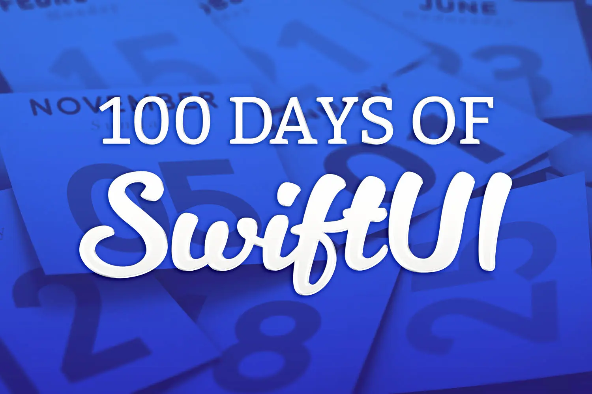
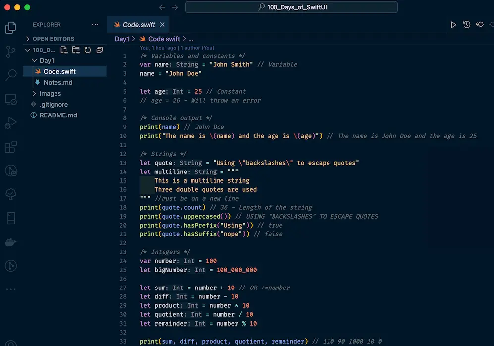

### 100 Days of SwiftUI

Today I started the [100 Days of SwiftUI](https://www.hackingwithswift.com/100/swiftui) course by [Paul Hudson](https://mastodon.social/@twostraws). I've been wanting to learn iOS development for a while now, and I think this is a great opportunity to do so. I'm excited to see what I can build with it.

This post will be updated as I progress through the course. I will be adding the new things I learn and the projects I build as I go along. I will try not to skip any days, but we will see how it goes.

So far all my experience with Swift is limited to this [Frontend Masters tutorial](https://frontendmasters.com/courses/swift-ios/) by [Maximiliano Firtman](https://firt.dev/). So, I have some basic knowledge of the language and the framework, but I'm still a beginner.

In addition to this post, my progress can be followed on:

- [Mastodon](https://notacult.social/@villivald) (updates and thoughts)
- [Github](https://github.com/villivald/100_Days_of_SwiftUI/tree/main) (code)

#### Day 1: Variables, constants, strings, and numbers

Today I reviewed some basic concepts of Swift. I already knew about variables and constants, but I learned a couple of new things as well. For example, I learned about multi-line strings (`"""`), type safety (1 + 2.0 = error), and a couple of useful methods (`uppercased()`, `hasPrefix()`, `isMultiple(of:)`). Of course, the first day was an easy one, but nevertheless, it was a good refresher.

---
